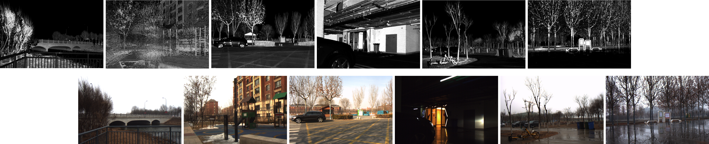

# MIAS-LCEC
<p align="center">
  
</p>

MIAS-LCEC is a novel online, target-free LiDAR-camera extrinsic calibration framework developed by Zhiwei Huang with the [MIAS Group](https://mias.group/). Extensive experiments conducted on real-world datasets demonstrate the robustness of our approach and its superior performance compared to SoTA methods, particularly for the solid-state LiDARs with super-wide fields of view. To benefit the robotics community, we have published MIAS-LCEC Toolbox, a versatile calibration toolbox with an interactive visualization interface, along with the MIAS-LCEC Datasets, which include three real-world datasets for evaluating LiDAR-camera extrinsic calibration algorithms.

📌: *Online, Target-Free LiDAR-Camera Extrinsic Calibration via Cross-Modal Mask Matching*, available at [arXiv](https://arxiv.org/abs/2404.18083).

🍇: Toolbox versions
* **2024/07/1**: MIAS-LCEC Toolbox has been developed by Zhiwei Huang @Tongji University.

⭐: **What is our contribution?** We move one step forward in the field of online, target-free LCEC by unleashing the potential of SoTA large vision models (LVMs). The cornerstone of our framework is cross-modal mask matching (C3M) algorithm, which enhances the robustness and accuracy of feature correspondence between LiDAR point clouds and camera images. Our method dramatically outperforms other calibration approaches in challenging conditions, particularly under poor illumination and adverse weather, or when few geometric features are detectable.


⭐: **What can MIAS-LCEC Toolbox do?** MIAS-LCEC Toolbox is a versatile calibration toolbox that supports **3D sensor data browsing**, **online, target-free LiDAR-camera extrinsic calibration** and **manual, offline calibration**. To begin calibration, simply load your point cloud and image source files into the GUI and click a button. After calibration, you can view the rendered RGB point cloud using the calibrated extrinsic parameters to verify the results.

<p align="center">

</p>

<center><sup> Viewing rendered point cloud within the toolbox interface to check the visualization of calibration result </sup></center>


<hr style="height:2px;border-width:0;color:gray;background-color:gray">

## 1. Publication:
This [paper](https://arxiv.org/pdf/2404.18083.pdf) was accepted to IEEE Trans. on Intelligent Vehicles (T-IV). In this repository, we publish our toolbox software and its applicational tutorial. Please cite our paper when using our toolbox or datasets. 📣 Thank you!

```
@article{huang2024online,
  title={Online, Target-Free LiDAR-Camera Extrinsic Calibration via Cross-Modal Mask Matching},
  author={Huang, Zhiwei and Zhang, Yikang and Chen, Qijun and Fan, Rui},
  journal={IEEE Transactions on Intelligent Vehicles},
  year={2024}
}
```


## 2. Demo Video:
In this video ([Bilibili Link](https://www.bilibili.com/video/BV1s6WKeVEpV/?vd_source=cf93904b8bc8a635be9d176e12917b6d) | [YouTube Link](https://www.youtube.com/watch?v=Pe-cuow1e1Q)), we demonstrate: 
* Our proposed calibration framework MIAS-LCEC 
* Introduction of three real-world datasets 
* Calibration examples using MIAS-LCEC Toolbox

<p align="center">

</p>


## 3. Datasets
We have created the following three real-world datasets:
**MIAS-LCEC-TF70 (target-free)**, **MIAS-LCEC-CB70 (target-based)**, and **MIAS-LCEC-TF360 (target-free)**, which are now publicly available at [Google Drive](https://drive.google.com/open?id=1-9dsrJVGIpYYzdxljBMHtFychXX0BsOX&usp=drive_fs) and [BaiduDuYun](https://pan.baidu.com/s/1pYPzNmDKru4WhEcVQwgdUg?pwd=z2qg) for researchers to evaluate the performance of LCEC approaches. Two solid-state Livox LiDARs (Livox Mid-70 and Livox Mid-360) and one MindVision camera are utilized for data acquisition. Point clouds and images in the datasets are collected from a variety of indoor and outdoor environments, under various scenarios as well as different weather and illumination conditions. 

<p align="center">

</p>

<!-- *<sup>...</sup>*-->


## 4. Installation
To install MIAS-LCEC Toolbox, please refer to the [Installation Introduction](./doc/installation.md).


## 5. Getting Started
Please refer to the [User Guide](./doc/program.md) for application details of MIAS-LCEC Toolbox. Hope you enjoy!


## 6. Contact
Please feel free to drop me emails [*zhiwei.huang@outlook.com*] if you have any questions.


## Acknowledgement
This research was supported by the National Science and Technology Major Project under Grant 2020AAA0108101, the National Natural Science Foundation of China under Grant 62233013, the Science and Technology Commission of Shanghai Municipal under Grant 22511104500, the Fundamental Research Funds for the Central Universities, and Xiaomi Young Talents Program.

<details>
<summary>
<a href="https://github.com/ChaoningZhang/MobileSAM">MobileSAM</a> (Faster Segment Anything) [<b>bib</b>]
</summary>

```bibtex
@article{mobile_sam,
  title={Faster Segment Anything: Towards Lightweight SAM for Mobile Applications},
  author={Zhang, Chaoning and Han, Dongshen and Qiao, Yu and Kim, Jung Uk and Bae, Sung-Ho and Lee, Seungkyu and Hong, Choong Seon},
  journal={arXiv preprint arXiv:2306.14289},
  year={2023}
}
```
</details>


